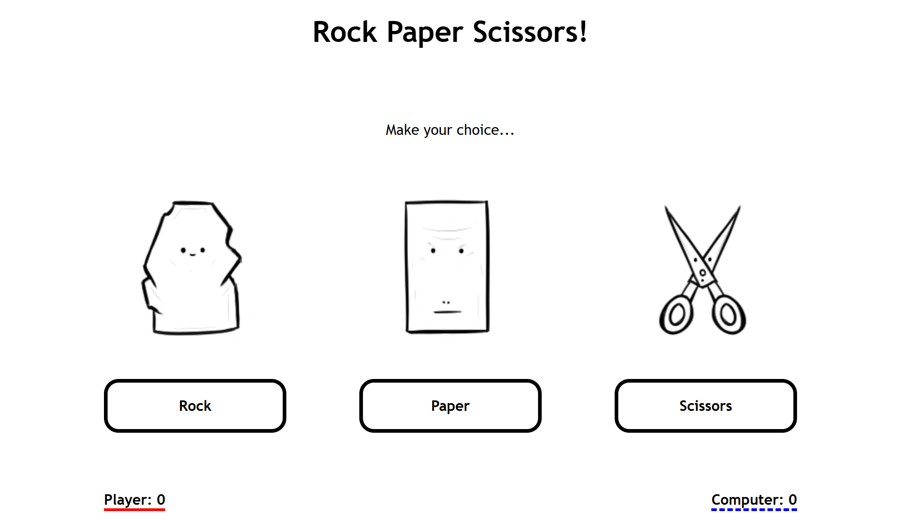

# Project: Rock Paper Scissors

## Description

- In this project, I created a rock paper scissors game using JavaScript, HTML, and CSS
- The project started as a console game, but was updated to be interactive using DOM manipulation
- Live preview: https://averdonks.github.io/rock-paper-scissors/
    - Click the link and select "Rock", "Paper", or "Scissors" using the provided buttons
    - The game plays until either you or the computer reaches 5 points
    - To replay the game, refresh your browser

## Image Preview

## Skills

HTML/CSS
- Layout, structure, and style

JavaScript
- Variables
- Comments
- Conditionals
- Loops
- Functions
- DOM manipulation and events

Git
- Version control

## Reflection

This project was helpful for putting the fundamental JavaScript concepts I've been learning into practice as well as gaining experience with DOM manipulation and events.

